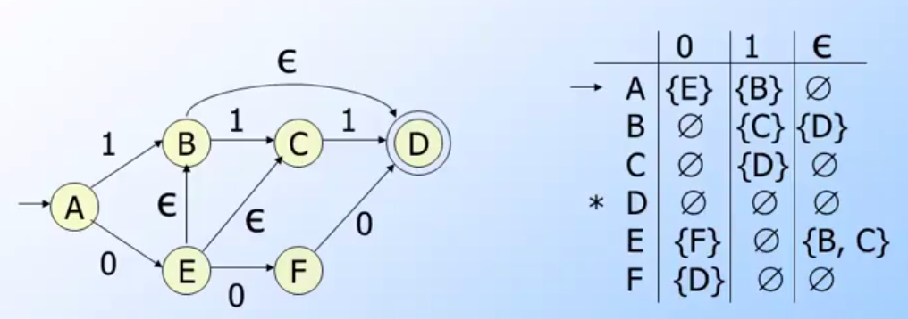

ε-NFA: Epsilon-Nondeterministic finite automaton
==============

[](https://raw.githubusercontent.com/kkdai/e-nfa/master/LICENSE)  [](https://godoc.org/github.com/kkdai/nfa)  [](https://travis-ci.org/kkdai/e-nfa)


What is Epsilon-Nondeterministic finite automaton
=============

`ε-NFA`: Epsilon-Nondeterministic finite automaton (so call:Nondeterministic finite automaton with ε-moves)

In the automata theory, a nondeterministic finite automaton with ε-moves (NFA-ε)(also known as NFA-λ) is an extension of nondeterministic finite automaton(NFA), which allows a transformation to a new state without consuming any input symbols. The transitions without consuming an input symbol are called ε-transitions or λ-transitions. In the state diagrams, they are usually labeled with the Greek letter ε or λ.

(sited from [here](https://en.wikipedia.org/wiki/Nondeterministic_finite_automaton))


Looking for DFA implement?
=============

I also write a DFA implenent in Go here. [https://github.com/kkdai/dfa](https://github.com/kkdai/dfa)

Looking for NFA implement?
=============

I also write a NFA implenent in Go here. [https://github.com/kkdai/dfa](https://github.com/kkdai/nfa)


Installation and Usage
=============


Install
---------------

    go get github.com/kkdai/e-nfa


Usage
---------------

Following is sample code to implement a epsilon-NFA automata diagram as follow:




```go

package main

import (
    "github.com/kkdai/enfa"
    "fmt"
)

func main() {

	nfa := NewENFA(0, false)
	nfa.AddState(1, false)
	nfa.AddState(2, false)
	nfa.AddState(3, true)
	nfa.AddState(4, false)
	nfa.AddState(5, false)

	nfa.AddTransition(0, "1", 1)
	nfa.AddTransition(0, "0", 4)

	nfa.AddTransition(1, "1", 2)
	nfa.AddTransition(1, "", 3) //epsilon
	nfa.AddTransition(2, "1", 3)
	nfa.AddTransition(4, "0", 5)
	nfa.AddTransition(4, "", 1, 2) //E -> epsilon B C
	nfa.AddTransition(5, "0", 3)

	nfa.PrintTransitionTable()

	if !nfa.VerifyInputs([]string{"1"}) {
		fmt.Printf("Verify inputs is failed")
	}

	nfa.Reset()

	if !nfa.VerifyInputs([]string{"1", "1", "1"}) {
		fmt.Printf("Verify inputs is failed")
	}

	nfa.Reset()

	if !nfa.VerifyInputs([]string{"0", "1"}) {
		fmt.Printf"Verify inputs is failed")
	}

	nfa.Reset()
	if !nfa.VerifyInputs([]string{"0", "0", "0"}) {
		fmt.Printf("Verify inputs is failed")
	}
}

```

Inspired By
=============

- [ε-NFA: Wiki](https://en.wikipedia.org/wiki/Nondeterministic_finite_automaton_with_%CE%B5-moves)
- [Coursera: Automata](https://class.coursera.org/automata-004/)

Project52
---------------

It is one of my [project 52](https://github.com/kkdai/project52).


License
---------------

This package is licensed under MIT license. See LICENSE for details.
